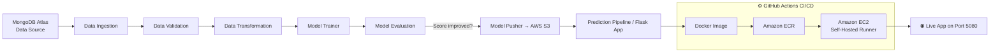

<div align="center">

# 🚗 Vehicle Data — End-to-End MLOps Pipeline

### Production-grade Machine Learning system with automated CI/CD, cloud-native deployment, and MLOps best practices

[](https://www.python.org/)
[](https://www.mongodb.com/atlas)
[](https://aws.amazon.com/)
[](https://www.docker.com/)
[](https://github.com/features/actions)
[](LICENSE)

</div>

---

## 📌 Overview

This project implements a **fully automated, production-ready Machine Learning pipeline** — from raw data ingestion in MongoDB Atlas to a containerized Flask application, continuously deployed to an AWS EC2 instance via a self-hosted GitHub Actions runner.

It's built the way real ML systems run in industry: modular components, versioned artifacts, cloud storage for models, and a CI/CD pipeline that ships every commit straight to production.

> 💡 **Why this project matters:** It demonstrates the full lifecycle a Data/ML Engineer owns in the real world — not just model training, but data engineering, cloud infrastructure, containerization, and deployment automation.

---

## 🏗️ Architecture



---

## 🧰 Tech Stack

| Category | Tools & Services |
|---|---|
| **Language** | Python 3.10 |
| **Database** | MongoDB Atlas (NoSQL, cloud-hosted) |
| **Cloud Provider** | AWS (IAM, S3, EC2, ECR) |
| **Containerization** | Docker |
| **CI/CD** | GitHub Actions + Self-Hosted Runner |
| **Web Framework** | Flask (`app.py`) |
| **Env Management** | Conda + `requirements.txt` |
| **Packaging** | `setup.py`, `pyproject.toml` (local package imports) |
| **Logging & Exception Handling** | Custom logger & exception modules |
| **EDA / Feature Engineering** | Jupyter Notebooks |

---

## ✨ Key Features

- 🔄 **Modular ML Pipeline** — clean separation of Data Ingestion, Validation, Transformation, Model Training, Evaluation, and Model Pusher components
- ☁️ **Cloud-Native Data Layer** — raw data stored and served from MongoDB Atlas
- 📦 **Artifact & Model Versioning** — every pipeline run produces traceable artifacts and models pushed to **AWS S3**
- 🐳 **Dockerized Application** — consistent, reproducible deployment environment
- 🚀 **Automated CI/CD** — every push to `main` triggers build → push to **ECR** → deploy on **EC2**, with zero manual steps
- 🖥️ **Self-Hosted GitHub Runner on EC2** — full control over the deployment compute environment
- 🌐 **Live Prediction Endpoint** — real-time inference served via Flask, with a dedicated `/training` route to trigger retraining on demand
- 🛡️ **Custom Logging & Exception Framework** — production-style error handling and traceability across every module

---

## 📁 Project Structure

```
├── src/
│   ├── components/          # Data ingestion, validation, transformation, trainer, evaluation, pusher
│   ├── configuration/        # MongoDB & AWS connection configs
│   ├── data_access/           # DB → DataFrame translation layer
│   ├── entity/                 # Config & artifact entity classes, estimator.py, s3_estimator.py
│   ├── aws_storage/          # S3 push/pull utilities
│   ├── constants/               # Central constants (thresholds, bucket names, etc.)
│   ├── utils/                    # Shared utility functions
│   ├── logger/                  # Custom logging module
│   └── exception/            # Custom exception module
├── notebook/                # EDA, feature engineering & MongoDB push notebooks
├── static/ & templates/     # Frontend assets for the Flask app
├── .github/workflows/       # CI/CD pipeline (aws.yaml)
├── Dockerfile / .dockerignore
├── app.py                   # Flask entry point + prediction & training routes
├── requirements.txt
├── setup.py / pyproject.toml
└── schema.yaml               # Dataset schema for data validation
```

---

## ⚙️ Local Setup

```bash
# 1. Clone the repository
git clone <your-repo-url>
cd <project-folder>

# 2. Create and activate a virtual environment
conda create -n vehicle python=3.10 -y
conda activate vehicle

# 3. Install dependencies
pip install -r requirements.txt

# 4. Verify local packages
pip list
```

### 🔐 Environment Variables

```bash
# MongoDB connection
export MONGODB_URL="mongodb+srv://<username>:<password>@<cluster-url>/?retryWrites=true&w=majority"

# AWS credentials
export AWS_ACCESS_KEY_ID="<your-access-key>"
export AWS_SECRET_ACCESS_KEY="<your-secret-key>"
```

---

## ☁️ Cloud Infrastructure

**MongoDB Atlas** — data source, connected via a secure connection string with network access configured for the application layer.

**AWS Services:**
| Service | Purpose |
|---|---|
| **IAM** | Secure programmatic access via scoped users |
| **S3** | Model registry — stores and versions trained models |
| **ECR** | Docker image registry |
| **EC2** | Hosts the self-hosted GitHub Actions runner & live application |

---

## 🔄 CI/CD Pipeline

1. Code is pushed to `main`
2. **GitHub Actions** builds the Docker image
3. Image is pushed to **Amazon ECR**
4. **Self-hosted runner on EC2** pulls the latest image and redeploys the container
5. App goes live on `http://<EC2-Public-IP>:5080`

All fully automated — **no manual deployment steps** after the initial infrastructure setup.

---

## 🚦 Model Retraining

The app exposes a dedicated `/training` route, allowing the full pipeline (ingestion → validation → transformation → training → evaluation → pusher) to be re-triggered on demand, with the model only promoted to production if it beats the existing one on the evaluation threshold.

---

## 📈 Future Scope

- [ ] Add model monitoring & drift detection
- [ ] Integrate MLflow for experiment tracking
- [ ] Add automated testing (unit + integration) in the CI pipeline
- [ ] Move to a managed orchestrator (Airflow / Kubeflow) for scheduling

---

## 🙌 Acknowledgements

Built as a hands-on demonstration of end-to-end MLOps practices — data engineering, cloud infrastructure, CI/CD automation, and deployment — combined into a single, cohesive, production-style pipeline.

---

<div align="center">

**⭐ If you found this project interesting, consider giving it a star!**

</div>
